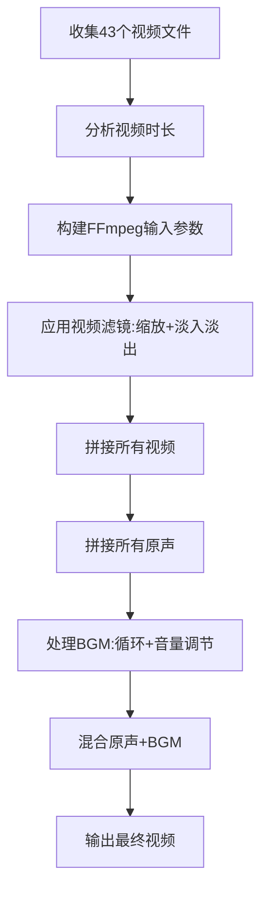

# NPC视频剪辑完整教程

## 项目概述

本教程介绍如何使用FFmpeg将43个NPC视频（npc1.mp4 ~ npc43.mp4）拼接成一个完整的视频，并添加丝滑转场效果和背景音乐（BGM）。

---

## 文件位置

| 类型 | 路径 |
|------|------|
| 视频文件 | `D:\雨下雨停\OneDrive\文档\npc1.mp4` ~ `npc43.mp4` |
| 背景音乐 | `D:\雨下雨停\Arrow BGM.mp3` |
| 输出目录 | `D:\雨下雨停\output\` |

---

## 前置准备

### 1. 安装FFmpeg

```bash
# 使用winget安装FFmpeg
winget install --id=Gyan.FFmpeg -e
```

安装后FFmpeg位于：
```
C:\Users\雨下雨停\AppData\Local\Microsoft\WinGet\Packages\Gyan.FFmpeg_Microsoft.Winget.Source_8wekyb3d8bbwe\ffmpeg-8.0.1-full_build\bin\ffmpeg.exe
```

### 2. 验证安装

```bash
ffmpeg -version
```

---

## 剪辑方案

### 方案一：保留原声 + 添加BGM（推荐）

使用Python脚本 `merge_with_audio.py`：

```bash
cd "D:/雨下雨停"
python merge_with_audio.py
```

**输出文件：** `npc_with_original_audio_and_bgm.mp4`

**特点：**
- ✅ 保留所有视频的原声
- ✅ 添加Arrow BGM作为背景音乐
- ✅ 丝滑淡入淡出转场效果
- ✅ BGM音量可调节

---

### 方案二：仅BGM（无原声）

```bash
cd "D:/雨下雨停"
python merge_videos_final.py
```

**输出文件：** `npc_simple.mp4`

---

## 核心FFmpeg命令解析

### 1. 视频拼接命令

```bash
ffmpeg \
  -i npc1.mp4 -i npc2.mp4 -i npc3.mp4 ... \
  -filter_complex "[0:v][1:v][2:v]...concat=n=43:v=1:a=0[v]" \
  -map "[v]" \
  -c:v libx264 -preset slow -crf 20 -pix_fmt yuv420p \
  output.mp4
```

### 2. 添加淡入淡出效果

```bash
# 第一个视频：淡入
fade=t=in:st=0:d=0.5

# 最后一个视频：淡出
fade=t=out:st=0:d=0.5

# 中间视频：淡入+淡出
fade=t=in:st=0:d=0.3,fade=t=out:st=7.5:d=0.3
```

### 3. 音频混合（原声+BGM）

```bash
# 拼接原声
[0:a][1:a][2:a]...concat=n=43:v=0:a=1[aout1]

# 处理BGM（音量2.0）
[43:a]atrim=0:344,asetpts=PTS-STARTPTS,volume=2.0[aout2]

# 混合音频
[aout1][aout2]amix=inputs=2:weights=1.0 1.5[aout]
```

### 4. 完整命令示例

```bash
ffmpeg \
  -i npc1.mp4 -i npc2.mp4 ... -i npc43.mp4 \
  -stream_loop -1 -i "Arrow BGM.mp3" \
  -filter_complex "
    [0:v]scale=1920:1080:force_original_aspect_ratio=decrease,pad=1920:1080:(ow-iw)/2:(oh-ih)/2,fade=t=in:st=0:d=0.5[v0];
    [1:v]scale=1920:1080:force_original_aspect_ratio=decrease,pad=1920:1080:(ow-iw)/2:(oh-ih)/2,fade=t=in:st=0:d=0.3,fade=t=out:st=7.5:d=0.3[v1];
    ...
    [v0][v1]...[v42]concat=n=43:v=1:a=0[vout];
    [0:a][1:a]...[42:a]concat=n=43:v=0:a=1[aout1];
    [43:a]atrim=0:344,asetpts=PTS-STARTPTS,volume=2.0[aout2];
    [aout1][aout2]amix=inputs=2:weights=1.0 1.5[aout]
  " \
  -map "[vout]" -map "[aout]" \
  -c:v libx264 -preset slow -crf 20 -pix_fmt yuv420p \
  -c:a aac -b:a 192k -shortest \
  output.mp4
```

---

## Python脚本说明

### merge_with_audio.py - 主脚本

```python
#!/usr/bin/env python3
# -*- coding: utf-8 -*-
"""
拼接43个NPC视频，保留原声，同时添加BGM
"""

import subprocess
import os

# 配置路径
FFMPEG_PATH = r"C:\Users\雨下雨停\AppData\Local\Microsoft\WinGet\Packages\Gyan.FFmpeg_Microsoft.Winget.Source_8wekyb3d8bbwe\ffmpeg-8.0.1-full_build\bin\ffmpeg.exe"

VIDEO_DIR = r"D:\雨下雨停\OneDrive\文档"
AUDIO_FILE = r"D:\雨下雨停\Arrow BGM.mp3"
OUTPUT_DIR = r"D:\雨下雨停\output"
OUTPUT_FILE = os.path.join(OUTPUT_DIR, "npc_with_original_audio_and_bgm.mp4")

# BGM音量设置
BGM_VOLUME = 2.0      # BGM基础音量
BGM_MIX_WEIGHT = 1.5  # 混合权重
```

**关键参数说明：**

| 参数 | 说明 | 默认值 |
|------|------|--------|
| `BGM_VOLUME` | BGM基础音量倍数 | 2.0 |
| `BGM_MIX_WEIGHT` | BGM在混音中的权重 | 1.5 |
| `FADE_IN_DURATION` | 淡入时长 | 0.5秒 |
| `FADE_OUT_DURATION` | 淡出时长 | 0.3秒 |
| `-crf` | 视频质量（0-51，越小越好） | 20 |
| `-preset` | 编码速度 | slow |

---

## 音量调节指南

### 如果BGM太小

增大 `volume` 和 `weights` 值：

```python
# 当前设置（BGM较小）
volume=2.0
weights=1.0 1.5

# BGM更大
volume=3.0
weights=1.0 2.0

# BGM非常大
volume=5.0
weights=1.0 3.0
```

### 如果BGM太大

减小 `volume` 和 `weights` 值：

```python
# BGM适中
volume=1.5
weights=1.0 1.0

# BGM较小
volume=1.0
weights=1.0 0.5
```

### 只要BGM不要原声

```python
# 直接使用BGM，不混合原声
filter_complex = "[43:a]atrim=0:344,asetpts=PTS-STARTPTS[volume=3.0[a]"
```

---

## 输出文件对比

| 文件名 | 大小 | 说明 |
|--------|------|------|
| `npc_combined_final.mp4` | 162 MB | 仅BGM，带淡入淡出 |
| `npc_simple.mp4` | 184 MB | 简单拼接+BGM |
| `npc_with_transitions.mp4` | 361 MB | 仅BGM，更多转场 |
| `npc_with_original_audio_and_bgm.mp4` | 361 MB | **原声+BGM（推荐）** |

---

## 故障排除

### 问题1：FFmpeg命令找不到

```bash
# 解决方法：添加FFmpeg到PATH
setx PATH "%PATH%;C:\Users\雨下雨停\AppData\Local\Microsoft\WinGet\Packages\Gyan.FFmpeg_Microsoft.Winget.Source_8wekyb3d8bbwe\ffmpeg-8.0.1-full_build\bin"
```

### 问题2：视频时长不匹配

使用 `-shortest` 参数让输出以最短的流为准：

```bash
ffmpeg ... -shortest output.mp4
```

### 问题3：中文路径问题

FFmpeg在Windows上处理中文路径可能有编码问题，建议：

1. 使用英文路径
2. 或在Python中使用 `encoding='utf-8', errors='ignore'`

---

## 进阶技巧

### 1. 更平滑的转场效果

使用 `xfade` 滤镜实现更多转场类型：

```bash
# 淡入淡出（当前使用）
xfade=transition=fade:duration=0.5:offset=7.5

# 其他可用转场
xfade=transition=dissolve:duration=0.5:offset=7.5
xfade=transition=pixelize:duration=0.5:offset=7.5
xfade=transition=wipeleft:duration=0.5:offset=7.5
xfade=transition=slideright:duration=0.5:offset=7.5
```

### 2. 添加音频淡入淡出

```bash
# BGM淡入淡出
[43:a]afade=t=in:st=0:d=1,afade=t=out:st=343:d=1[a]
```

### 3. 调整视频速度

```bash
# 加速1.5倍
[0:v]setpts=PTS/1.5[v]
```

---

## 完整工作流程



---

## 常用命令速查

```bash
# 获取视频时长
ffprobe -v error -show_entries format=duration -of default=noprint_wrappers=1:nokey=1 input.mp4

# 获取视频信息
ffprobe -i input.mp4

# 简单拼接（无滤镜）
ffmpeg -f concat -safe 0 -i list.txt -c copy output.mp4

# 添加BGM
ffmpeg -i video.mp4 -i bgm.mp3 -filter_complex "[1:a]volume=2.0[a];[0:a][a]amix=inputs=2" output.mp4

# 淡入淡出
ffmpeg -i input.mp4 -vf "fade=t=in:st=0:d=1,fade=t=out:st=9:d=1" output.mp4
```

---

## 总结

1. **推荐使用 `merge_with_audio.py` 脚本**，它保留了原声并添加了BGM
2. **BGM音量可以在脚本中调节**，修改 `BGM_VOLUME` 和 `BGM_MIX_WEIGHT` 变量
3. **输出文件位于** `D:\雨下雨停\output\` 目录
4. **总时长约5分44秒**（344秒），包含43个视频

如有问题或需要进一步调整，请告诉我！
